# StatsConnect contributor and operations guide

This is the working handbook for setting up, changing, deploying, and operating the StatsConnect network. It describes the code in this repository as of **August 13, 2026**. Pricing is time-sensitive; use the linked vendor pages before making a budget decision.

> [!IMPORTANT]
> Production delivery is in a partially merged state. The intended design is one Vercel deployment and one Convex deployment, but the root `deploy:unified` command currently calls a missing backend script, while an older GitHub Action can also deploy the backend. Read [Production deployment](#production-deployment) before releasing anything.

## Contents

- [System and repository](#system-in-one-picture)
- [Local setup](#local-setup)
- [Environment variables and secrets](#environment-variables-and-secrets)
- [Backend architecture](#how-the-backend-is-organized)
- [Scheduled work and retention](#scheduled-work-and-retention)
- [Making and verifying changes](#making-a-change)
- [Production deployment](#production-deployment)
- [Cost model](#cost-model)
- [Operations and troubleshooting](#operations-and-troubleshooting)
- [Security baseline](#security-baseline)

## System in one picture

```mermaid
flowchart TD
  Browser["Browser"] --> Vercel["One Vercel static deployment"]
  Vercel --> Hub["/ — StatsConnect Hub"]
  Vercel --> Brawl["/brawlstars/* — BrawlStats Game Site"]
  Vercel --> Clash["/clashroyale/* — ClashCrown Game Site"]
  Hub --> Convex["One Convex Platform Backend"]
  Brawl --> Convex
  Clash --> Convex
  Convex --> BrawlAPI["Official Brawl Stars API + BrawlAPI"]
  Convex --> ClashAPI["Official Clash Royale API, normally through fixed-egress proxy"]
```



The three frontends are independent React SPAs. They share navigation and error packages, and they call one Convex backend. The backend keeps Hub, Brawl Stars, and Clash Royale code in separate namespaces so a game can be split out later without first untangling its data model.

## Vocabulary

- **Hub**: the StatsConnect site that owns game discovery, connected profiles, and launch routes.
- **Game Site**: BrawlStats or ClashCrown, each with its own routes and visual design.
- **Site Navigation**: the shared network-level navigation from `packages/site-nav`.
- **Game Switcher**: the control in Site Navigation that sends users through a Hub launch route.
- **Launch Route**: `/launch/:game` in the Hub. It resolves a connected tag before opening a Game Site.
- **Platform Backend**: the canonical Convex deployment in `packages/backend`.

Use these names in code, issues, and documentation. See [`CONTEXT.md`](./CONTEXT.md) for the complete domain-language rules.

## Repository map

| Path | Owner and purpose |
| --- | --- |
| `apps/statsconnect` | Hub SPA, browser-local viewer identity, connected profiles, and launch flows |
| `apps/brawlstats` | Brawl Stars SPA and historical app-local Convex source |
| `apps/clashcrown` | Clash Royale SPA and historical app-local Convex source |
| `packages/backend` | **Canonical** production Convex schema, functions, HTTP routes, and crons |
| `packages/site-nav` | Shared Site Navigation and Game Switcher |
| `packages/site-errors` | Shared React error presentation |
| `docs/adr` | Accepted architecture decisions |
| `docs/UNIFIED_DEPLOYMENT.md` | Data consolidation and cutover notes |
| `scripts/prepare-convex-import.mjs` | Rewrites old game snapshots for the unified schema |
| `vercel.json` | Unified static build output and SPA route rewrites |

The `apps/*/convex` directories are legacy/reference backends from the formerly separate projects. Frontend typechecks still include some of them, but production deployment from the repository root uses only `packages/backend/convex`. Put new production backend work in `packages/backend/convex`.

Generated files have special handling:

- Do not hand-edit `routeTree.gen.ts` or any `convex/_generated` file.
- TanStack Router regenerates route trees from `src/routes`.
- `convex dev` regenerates Convex API and data-model types.
- The canonical generated backend types are tracked, so commit them when a schema or function surface changes.

## Current stack

- pnpm 10.12.3 workspace
- Node.js 24 in GitHub Actions
- TypeScript 7
- React 19 and Vite 8
- TanStack Router and TanStack Query
- Tailwind CSS 4 and shadcn/Base UI components
- Convex 1.42-compatible source (`1.43.0` is currently locked)
- Vercel static hosting

There is no Vercel Function or separate API server in this repository. Server work happens in Convex.

## Local setup

### Prerequisites

Install:

- Node.js 24
- pnpm 10.12.3 through Corepack or another pnpm installation
- Access to the `statsconnect` Convex project for live development
- Supercell developer keys only if you need live API data

Never use npm or Yarn in this workspace, and do not create another lockfile.

### First checkout

From the repository root:

```sh
pnpm install --frozen-lockfile
pnpm typecheck
```

Start or link your personal Convex development deployment:

```sh
pnpm --filter @statsconnect/backend dev
```

Convex gives each team member a separate development deployment. It writes the deployment selector and URLs to `packages/backend/.env.local`. Set the same development deployment URL as `VITE_CONVEX_URL` in each frontend you run. Start from the tracked templates:

- `apps/statsconnect/.env.example`
- `apps/brawlstats/.env.example`
- `apps/clashcrown/.env-example`

Run only the surfaces you are changing:

```sh
pnpm dev:hub
pnpm dev:brawlstats
pnpm dev:clashcrown
```

The root `pnpm dev` runs the canonical backend and Hub together. It does not run both Game Sites.

### Development without upstream credentials

Set this in your personal Convex deployment to use deterministic Hub adapters:

```sh
pnpm --dir packages/backend exec convex env set STATSCONNECT_ADAPTER_MODE stub
```

Unset it before validating live behavior:

```sh
pnpm --dir packages/backend exec convex env remove STATSCONNECT_ADAPTER_MODE
```

The ClashCrown demo tags `CCDEMO` work without a Clash Royale key. Most crawler and live-profile work requires real server-side credentials.

## Environment variables and secrets

There are three different classes of variables. Do not mix them.

### Browser/build variables

Anything beginning with `VITE_` is compiled into public JavaScript. It must never contain a secret.

| Variable | Used by | Purpose |
| --- | --- | --- |
| `VITE_CONVEX_URL` | All frontends | Canonical `.convex.cloud` client URL; required for live data |
| `VITE_CONVEX_SITE_URL` | BrawlStats | Optional explicit `.convex.site` HTTP Actions URL |
| `VITE_STATSCONNECT_ORIGIN` | Game Sites | Hub origin used by Site Navigation and launch routing |
| `VITE_BRAWLSTATS_ORIGIN` | Hub | BrawlStats destination when using separate hostnames |
| `VITE_CLASHCROWN_ORIGIN` | Hub | ClashCrown destination when using separate hostnames |
| `NEXT_PUBLIC_CONVEX_URL` | ClashCrown compatibility path | Legacy fallback for `VITE_CONVEX_URL` |
| `NEXT_PUBLIC_STATSCONNECT_ORIGIN` | ClashCrown compatibility path | Legacy fallback for the Hub origin |
| `STATSCONNECT_UNIFIED_BUILD` | Vite build only | Sets Game Site base paths and writes all SPAs into root `dist` |

`convex deploy --cmd-url-env-var-name VITE_CONVEX_URL` should inject the production Convex URL during the unified Vercel build. Do not hard-code a deployment URL in source.

### Convex deployment variables

Set these on each Convex deployment that needs them, not in a frontend `.env` file:

```sh
pnpm --dir packages/backend exec convex env set VARIABLE_NAME value
pnpm --dir packages/backend exec convex env list --names-only
```

Add `--prod` only when deliberately changing production.

| Variable | Default | Purpose |
| --- | --- | --- |
| `BRAWL_STARS_API_TOKEN` | none | Official Brawl Stars API credential |
| `BRAWL_STARS_API_BASE_URL` | `https://api.brawlstars.com/v1` | Official API or fixed-egress proxy |
| `BRAWL_DISCOVER_LIMIT` | `200` | Ranking players considered per discovery run; max 200 |
| `BRAWL_CLUB_SEED` | `10` | Top clubs seeded per discovery run; max 50 |
| `BRAWL_CRAWL_BATCH` | `8` | Player targets processed every two minutes; max 25 |
| `BRAWL_CRAWL_REVISIT_MINUTES` | `30` | Delay before a target is eligible again; max 1,440 |
| `BRAWLSTATS_SERVICE_URL` | none | BrawlStats HTTP service used by the Hub adapter |
| `BRAWLSTATS_CACHE_TTL_SECONDS` | `300` | Hub-side Brawl profile cache TTL |
| `CLASH_ROYALE_API_TOKEN` | none | Official Clash Royale API credential |
| `CLASH_ROYALE_API_BASE_URL` | `https://api.clashroyale.com/v1` | Official API or fixed-egress proxy |
| `CLASH_ROYALE_CACHE_TTL_SECONDS` | `900` | Hub/Clash response cache TTL |
| `CLASH_DISCOVER_LIMIT` | `200` | Leaderboard players considered per discovery run; max 1,000 |
| `CLASH_CLAN_SEED` | `20` | Top clans seeded per discovery run; max 100 |
| `CLASH_CRAWL_BATCH` | `8` | Player targets processed every two minutes; max 50 |
| `CLASH_RANKING_SIZE` | `100` | Materialized decks retained per mode/window |
| `CLASH_MIN_DECK_USES` | `5` | Minimum observations before a deck is ranked |
| `BETA_ADMIN_KEY` | none | Protects manual Clash queue seeding on the beta page |
| `STATSCONNECT_ADAPTER_MODE` | live adapters | Set to `stub` for deterministic Hub development |

Supercell keys are source-IP restricted. Convex uses regional egress, so production normally needs a fixed-egress proxy. The existing ClashCrown documentation uses the RoyaleAPI proxy. A `403` usually means the key, proxy URL, or allow-listed IP does not agree.

### Deployment credentials

| Variable | Storage | Purpose |
| --- | --- | --- |
| `CONVEX_DEPLOY_KEY` | Vercel Production secret or GitHub Actions secret | Authorizes a production Convex deploy |
| `CONVEX_DEPLOYMENT` | Ignored local file | Selects a developer's Convex deployment |

Never expose `CONVEX_DEPLOY_KEY` to Vercel Preview or Development unless a separate preview-deployment workflow is intentionally configured. A production key in preview builds can let a pull request change production backend code.

Ignored `.env` files are convenience files, not a secrets manager. During this audit, local ignored files contained real-looking credentials. Rotate any still-valid Supercell credential, remove stale token-bearing files when safe, and keep production values in Convex/Vercel/GitHub secret storage.

## How the backend is organized

`packages/backend/convex/schema.ts` combines three table groups:

- `hub/*`: connected profiles, viewer settings, throttles, and response cache
- `brawl/*`: player/club history, battle observations, map/meta aggregates, crawler queue, runs, counters, and fetch logs
- `clash/*`: API cache, player/leaderboard history, battle/deck/card/tower aggregates, personalization, clan management, crawler queue, runs, counters, and fetch logs

The current schema has 52 tables and two text-search indexes. Game-owned functions and tables must not reach into another game's tables. Cross-game behavior belongs in `hub` or in an explicit adapter contract.

### Hub identity is currently browser-local

The current Hub is not using authenticated accounts. It creates a random UUID in `localStorage` and stores data under `session:<uuid>`. Clearing site data loses that browser's link to its connected profiles; copying a viewer ID effectively copies access. Do not describe this as authentication or use it for sensitive user data.

`docs/SPEC.md` describes a Lakebed Auth direction, not the runtime currently implemented in these React/Convex apps. Treat authentication migration as separate product work.

### Public API surfaces

- Hub and ClashCrown call typed Convex query, mutation, and action references.
- BrawlStats also uses public Convex HTTP Actions under `/api/*` on the `.convex.site` origin.
- The Brawl HTTP API currently allows cross-origin GET requests with `Access-Control-Allow-Origin: *`.
- External fetches and secrets belong in actions/HTTP actions; queries and mutations are deterministic database transactions.

### Convex contribution rules

For every change in `packages/backend/convex`:

- Use object-form function definitions.
- Add `args` and `returns` validators to every registered function.
- Default helpers and scheduled callbacks to internal functions.
- Use indexes for read paths; do not replace an index with a table-wide `.filter()`.
- Bound growing reads with `.take()` or pagination. Never use unbounded `.collect()` on a growing table.
- Keep Node runtime files action-only. The current Node modules are `clash/clashApi.ts` and `clash/clanManagementActions.ts`.
- Add new fields to populated tables as optional, backfill, then make them required in a later deploy.
- Store Convex storage IDs, not expiring file URLs.
- Batch action-to-database calls where possible: every `ctx.runQuery`, `ctx.runMutation`, and `ctx.runAction` has transaction and billing overhead.

The main transaction/document limits to design around are approximately 16,000 reads, 8,000 writes, 1 MiB per document, and a 10-minute action runtime. Confirm current values on the [Convex limits page](https://docs.convex.dev/production/state/limits).

## Scheduled work and retention

The canonical `packages/backend/convex/crons.ts` registers 11 jobs:

| Area | Job | Interval |
| --- | --- | --- |
| Hub | Refresh stale connected-profile caches | 10 minutes |
| Hub | Prune expired background data | 1 hour |
| Brawl | Discover ranked players and club members | 6 hours |
| Brawl | Crawl due player battle logs | 2 minutes |
| Brawl | Prune crawler telemetry | 6 hours |
| Clash | Refill crawl queue | 6 hours |
| Clash | Crawl battle logs | 2 minutes |
| Clash | Roll up deck rankings | 30 minutes |
| Clash | Prune expired rows | 6 hours |
| Clash | Observe tracked clans | 30 minutes |
| Clash | Prune clan-management history | 6 hours |

At those intervals, a 30-day month starts about **51,720 top-level scheduled executions** before any child queries, mutations, scheduled continuations, user traffic, or subscription updates. Increasing a batch setting does not change that top-level count, but it increases upstream API requests, action time, database I/O, and child function calls per tick.

History is prospective: the Supercell APIs expose current profiles and short battle logs, not complete historical datasets. Retention and deduplication are part of the product contract; do not remove a prune job or dedupe index without estimating storage and I/O growth.

## Making a change

### Choose the right ownership boundary

| Change | Primary location | Also verify |
| --- | --- | --- |
| Hub route or connection UX | `apps/statsconnect` | Hub functions and launch destinations |
| BrawlStats feature | `apps/brawlstats` | `packages/backend/convex/brawl`, HTTP routes, unified base path |
| ClashCrown feature | `apps/clashcrown` | `packages/backend/convex/clash`, unified base path |
| Cross-site navigation | `packages/site-nav` | All three apps, mobile menu, launch routing |
| Shared error UI | `packages/site-errors` | All consumers |
| Schema/function/cron | `packages/backend/convex` | Generated types, environment, cost, retention, migration |
| Production paths/build | root `package.json`, `vercel.json`, Vite configs | All direct and refreshed SPA routes |

Preserve Game Site branding. Shared packages own cross-network behavior, not each site's local layout.

### Verification

The required repository check is:

```sh
pnpm typecheck
```

Narrow checks are available while iterating:

```sh
pnpm --filter @statsconnect/backend typecheck
pnpm --filter statsconnect typecheck
pnpm --filter brawlstats.io typecheck
pnpm --filter clash-crown typecheck
```

There is currently no repository lint command and no automated test suite. A green typecheck is necessary but not sufficient. Manually verify the changed route against your development deployment, error/empty/loading states, the shared navigation when affected, and the corresponding `/beta` telemetry for crawler changes.

Before a backend change is considered ready, let `convex dev` push it to your development deployment and fix schema or code-generation errors. Do not test schema migrations for the first time in production.

### Pull request checklist

- Scope is owned by the correct app/package/namespace.
- No secrets or production deployment URLs are in the diff.
- `pnpm-lock.yaml` changes only when dependencies changed through pnpm.
- Generated route/API types were regenerated, not hand-edited.
- New Convex functions have arguments and return validators.
- New database read paths have indexes and bounded result sizes.
- Schema changes include an existing-data migration plan.
- Cron/crawler changes include a call, compute, I/O, retention, and upstream-rate estimate.
- `pnpm typecheck` passes.
- Unified subpaths and direct-refresh routes were manually checked where relevant.
- User-facing behavior and deployment/environment changes are documented.

## Production deployment

### Intended production topology

ADR 0002 and the root `vercel.json` define the current target:

| URL | Artifact |
| --- | --- |
| `https://stats.juanquenga.com/` | StatsConnect Hub |
| `https://stats.juanquenga.com/brawlstars/*` | BrawlStats |
| `https://stats.juanquenga.com/clashroyale/*` | ClashCrown |
| Production Convex URL | One Platform Backend for all three apps |

`build:unified` builds the Hub into `dist/`, BrawlStats into `dist/brawlstars`, and ClashCrown into `dist/clashroyale`. Root Vercel rewrites make each SPA refreshable at its routes.

Old app-level `vercel.json` files and the root README previously described three separate Vercel projects. They are migration artifacts, not the unified release entry point.

### Current release blockers

Do not treat `main` as safely deployable until these are resolved:

1. Root `pnpm deploy:unified` calls `@statsconnect/backend` script `deploy:with-frontend`, but that script is missing from the current backend `package.json`. The intended command from the unification change was:

   ```json
   "deploy:with-frontend": "convex deploy --cmd-url-env-var-name VITE_CONVEX_URL --cmd 'pnpm --dir ../.. build:unified'"
   ```

2. `.github/workflows/convex-production.yml` still deploys the production backend after changes to `packages/backend` on `main`. Once the Vercel atomic deploy command is restored, a backend-changing commit can start both deployment paths. Choose exactly one production deploy owner; the unified architecture points to the root Vercel project.
3. Production and preview secret scopes need verification. The production Convex deploy key must not be used by untrusted preview builds.
4. Legacy app deployments and old domains should either redirect to the unified paths or be explicitly retained and documented. Avoid having two writable production backends.

### Recommended release flow after the blockers are fixed

1. Open a pull request and get `pnpm typecheck` green.
2. If the schema changes, use an additive/optional schema first and run the backfill in a development deployment.
3. Review all Vercel Production variables and all Convex Production variables by name. Never paste their values into a PR.
4. Merge to `main`.
5. Let the root Vercel project run `pnpm deploy:unified`. Its Convex deploy command injects the exact production `VITE_CONVEX_URL` while building all three SPAs.
6. Verify Convex deployment logs and all 11 cron registrations.
7. Smoke-test Hub connect/launch, Brawl player/API/meta, Clash player/meta, Site Navigation, direct route refreshes, and both beta telemetry pages.
8. Watch Convex errors, function failure rate, action duration, database I/O, egress, and upstream `403`/`429` responses through the first crawler cycles.

Do not manually deploy an app-local `convex` directory. Do not run both the Vercel backend deploy and the GitHub backend workflow for the same release.

### Data migration, backup, and rollback

Read [`docs/UNIFIED_DEPLOYMENT.md`](./docs/UNIFIED_DEPLOYMENT.md) before moving data between deployments. The key rules are:

- Create a fresh target deployment; do not merge old snapshots directly into a live populated production deployment.
- Import the Hub snapshot intact so `viewerSettings.activeProfileId` references remain valid.
- Rewrite old Brawl and Clash table names with `scripts/prepare-convex-import.mjs`, compare manifest counts, then import table by table.
- Keep old production deployments available until the new frontend, data, APIs, and crons are verified.
- Pause old crawlers before final delta/cutover so two systems do not ingest the same upstream stream.

A Convex backup contains documents and stored files. It does **not** contain deployed functions, schema/configuration, environment variables, cron definitions, or pending scheduled functions. A Vercel frontend rollback also does not roll back Convex code or data. Keep the release commit, env inventory, and data snapshot together in the runbook.

## Cost model

### Convex pricing snapshot

As of August 13, 2026, the [official Convex pricing page](https://www.convex.dev/pricing) lists the following US-region resource allowances and overages. The Free plan uses hard caps; Starter is pay-as-you-go after its included usage. Professional is **$25 per developer per month** before overages.

| Resource | Free/Starter included | Starter overage | Professional included | Professional overage |
| --- | ---: | ---: | ---: | ---: |
| Function calls | 1 million/month | $2.20/million | 25 million/month | $2.00/million |
| Action compute | 20 GB-hours/month | $0.33/GB-hour | 250 GB-hours/month | $0.30/GB-hour |
| Database storage | 0.5 GB | $0.22/GB-month | 50 GB | $0.20/GB-month |
| Database I/O | 1 GB/month | $0.22/GB | 50 GB/month | $0.20/GB |
| File storage | 1 GB | $0.033/GB-month | 100 GB | $0.03/GB-month |
| Search storage | 0.5 GB | $0.55/GB-month | 1 GB | $0.50/GB-month |
| Search queries | 3,000 query-GB/month | $0.11/1,000 query-GB | 50,000 query-GB/month | $0.10/1,000 query-GB |
| Data egress | 1 GB/month | $0.132/GB | 50 GB/month | $0.12/GB |

EU-region usage is currently priced at 1.3×. Allowances and usage are aggregated across all projects in a Convex team, not granted separately to each StatsConnect deployment. Recheck [pricing](https://www.convex.dev/pricing), [limits](https://docs.convex.dev/production/state/limits), and the team usage dashboard before changing plans.

### What counts for this project

- A client query, mutation, action, HTTP action, scheduled execution, subscription update, or file access counts as a function call.
- Calls made from actions through `ctx.runQuery`, `ctx.runMutation`, or `ctx.runAction` add function calls. The crawlers make many of these per top-level cron tick.
- Reactive query updates can cost more than page loads because a changed result can execute and deliver again.
- Actions consume GB-hours. Default-runtime actions allocate 64 MiB; Node actions allocate 512 MiB. Compute is allocated GB multiplied by runtime hours.
- The two player-name search indexes add search storage and search-query usage.
- Battle/history ingestion drives database write I/O and storage; analytics and cache reads drive read I/O.
- Large profile/battle responses and public HTTP endpoints drive egress.
- Supercell/API proxy quotas are operational limits separate from Convex billing.

Useful rough formulas for Starter are:

```text
function overage = max(0, monthly calls - 1,000,000) / 1,000,000 × $2.20
action GB-hours = sum(action duration in hours × allocated runtime GB)
action overage = max(0, action GB-hours - 20) × $0.33
```

The 51,720 monthly cron starts alone fit under the 1-million-call allowance, but that number is not a bill estimate. Child calls, traffic, subscriptions, and I/O dominate as usage grows. Use Convex's Usage dashboard and set team usage limits/alerts for function calls, action compute, database I/O, storage, search, and egress.

### Other costs

- **Vercel**: the repository deploys static files, so there are no application Vercel Function invocations. Plan seats, build execution, CDN bandwidth, image optimization if later added, and domain traffic are billed under the connected Vercel account. Check the account's current plan rather than assuming a free deployment.
- **GitHub Actions**: the backend workflow consumes hosted-runner minutes when it runs; included minutes depend on repository visibility and account plan.
- **Domains/DNS**: registration and any external DNS/proxy service are outside this repository.
- **Supercell/BrawlAPI/RoyaleAPI**: this code assumes API access and quota/rate constraints. Confirm each provider's current terms before increasing crawler volume.

## Operations and troubleshooting

Useful production-safe read commands:

```sh
pnpm --dir packages/backend exec convex env list --prod --names-only
pnpm --dir packages/backend exec convex logs --prod
```

Do not run a mutation, import, or deploy just to inspect a problem.

| Symptom | First checks |
| --- | --- |
| Frontend says Convex is not configured | `VITE_CONVEX_URL` existed during the Vite build and points to the intended deployment |
| Brawl HTTP page returns 503 | `BRAWL_STARS_API_TOKEN` exists in that Convex deployment |
| Supercell returns 403 | Token validity, configured base URL, proxy, and allow-listed source IP |
| Supercell returns 429 | Crawler batch/revisit settings and upstream quota; do not add blind retries |
| Hub Brawl preview says not configured | `BRAWLSTATS_SERVICE_URL` and its cache TTL in Convex |
| Hub data disappeared in one browser | Browser-local viewer UUID changed or site storage was cleared |
| Direct URL is a Vercel 404 | Root rewrite, Vite base path, or generated route tree mismatch |
| Schema deploy fails | New required field conflicts with existing documents; widen, backfill, then narrow |
| Too many reads/writes | Unbounded query or oversized batch; paginate/schedule smaller batches |
| OCC conflict | Hot document/write contention; reduce shared writes or shard counters |
| Crawler looks idle | `/brawlstars/beta`, `/clashroyale/beta`, cron registration, pipeline runs, and fetch logs |
| Costs jump | Function child calls, crawler batch changes, reactive subscriptions, DB I/O, action duration, or egress |

## Security baseline

- Secrets only in Convex, Vercel, or GitHub secret storage.
- No Supercell key, Convex deploy key, or private URL in a `VITE_` variable.
- Treat ignored files as potentially sensitive and never attach them to issues.
- Keep public Convex functions minimal; make jobs/helpers internal.
- Validate every public argument and return value.
- The current Hub viewer UUID is not authentication. Do not put private/account-critical data behind it.
- Keep manual beta controls protected, rate-limited, and out of normal navigation.
- Review CORS before adding state-changing HTTP actions; current wildcard CORS is appropriate only for the read-only Brawl endpoints.
- Rotate a credential immediately if it appears in a commit, log, screenshot, chat, or artifact.

## Source-of-truth documents

Use this order when documents disagree:

1. Accepted ADRs, especially [`docs/adr/0002-unify-production-delivery-and-backend.md`](./docs/adr/0002-unify-production-delivery-and-backend.md)
2. Current root scripts/configuration and `packages/backend`
3. This contributor guide
4. [`docs/UNIFIED_DEPLOYMENT.md`](./docs/UNIFIED_DEPLOYMENT.md) for migration details
5. App READMEs for game-specific behavior
6. Older app-level deployment files and planning specs

If the architecture changes, update the ADR/configuration, this guide, and the root README in the same pull request.
